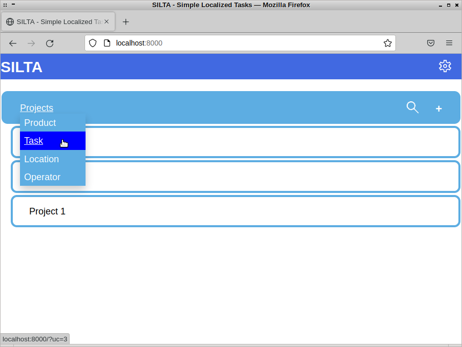
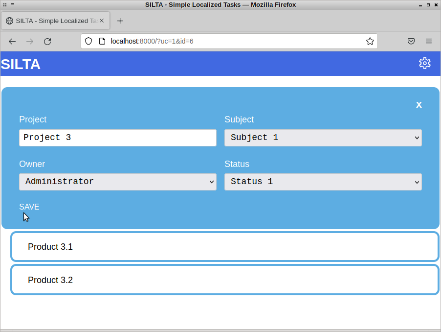
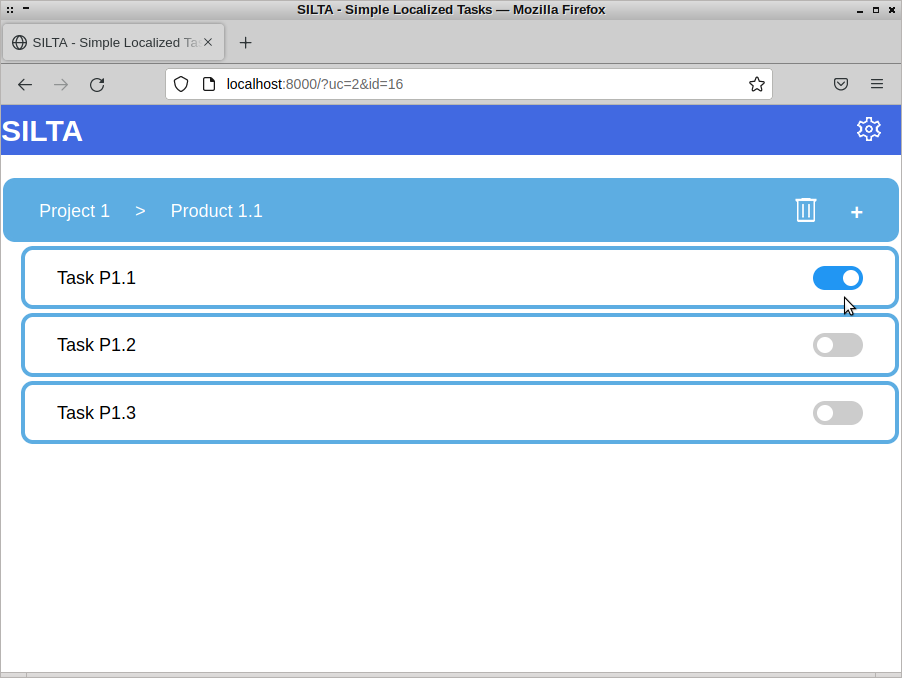

# SILTA - Simple Localized Tasks
A CODE REVIEW, PROOF-OF-CONCEPT UNDER CONSTRUCTION
## About
Lite browser-based personal task organizer

  
  
  

## Background
Python project SILTA began in early 2022 from the need to help manage Computer Forensics workflow. Inspired by the *Kirjuri* application *(github.com/AnttiKurittu/kirjuri)* the objective became to develop a personal organizer application for tasks.

## A ~~Work~~ Hobby In Progress
As of writing this on Feb 2023, new ideas for usability and better Python are brewing. Current goal is to allow the end-user configure task properties dynamically without re-inventing database schema as new business logic is required.

## Design philosophy
Code independency preferred over 3rd party imports. Keeping both the user interface and architecture concise is paramount. Pythonic expression is of uttermost importance. Adherence to *PEP 8* is a must. Learning. Coding. Having Fun.

## Requirements
Current design is based solely on built-in Python 3.9.5 modules and utilizes SQLite for data storage.

## Licensing
SILTA is released under the terms of the GNU General Public License version 3, https://www.gnu.org/licenses/gpl-3.0.en.html
